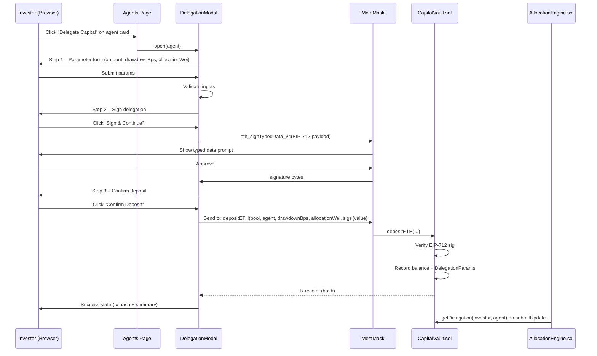
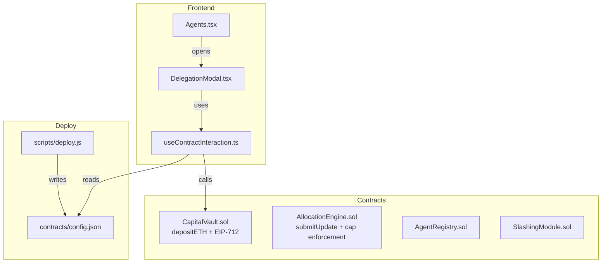

# Design Document: Agent Delegation Flow

## Overview

The Agent Delegation Flow adds a native-ETH deposit path to the DACAP platform, allowing investors to
delegate capital to autonomous AI agents through a secure, on-chain process. The flow is:

1. Investor browses the Agents page and clicks "Delegate Capital" on an agent card
2. A 3-step modal collects parameters (ETH amount, max drawdown bps, max allocation cap)
3. MetaMask presents an EIP-712 typed data signature prompt for the investor to review and sign
4. The investor confirms an ETH deposit transaction that calls `CapitalVault.depositETH()`
5. On success, the modal shows the transaction hash and a summary of the delegation

The existing `CapitalVault.sol` uses ERC20 tokens. This feature introduces a parallel ETH-native
deposit path without removing the existing ERC20 path. The deploy script is updated to write
deployed addresses to a JSON config file consumed by the frontend.

---

## Architecture





---

## Components and Interfaces

### 1. CapitalVault.sol – New Functions and Storage

New storage added alongside existing ERC20 storage:

```solidity
struct DelegationParams {
    address agent;
    uint256 maxDrawdownBps;
    uint256 maxAllocationWei;
}

// EIP-712 domain separator (set in constructor)
bytes32 public DOMAIN_SEPARATOR;

bytes32 public constant DELEGATION_TYPEHASH = keccak256(
    "DelegationParams(uint8 pool,address agent,uint256 amount,uint256 maxDrawdownBps,uint256 maxAllocationWei,address investor)"
);

// Per-investor, per-agent delegation params
mapping(address => mapping(address => DelegationParams)) public delegations;

event DelegationDeposited(
    address indexed investor,
    address indexed agent,
    uint8 pool,
    uint256 amount,
    uint256 maxDrawdownBps,
    uint256 maxAllocationWei
);
```

New function:

```solidity
function depositETH(
    uint8 pool,
    address agent,
    uint256 maxDrawdownBps,
    uint256 maxAllocationWei,
    bytes calldata signature
) external payable nonReentrant;
```

New view function:

```solidity
function getDelegation(address investor, address agent)
    external view returns (DelegationParams memory);
```

### 2. scripts/deploy.js – Config File Output

The deploy script is updated to:
- Deploy `CapitalVault` without an ERC20 token constructor argument (ETH-native)
- Write a `config.json` file after all contracts are deployed

Output path: `dacap/frontend/src/contracts/config.json`

Schema:
```json
{
  "CapitalVault": "0x...",
  "AllocationEngine": "0x...",
  "AgentRegistry": "0x...",
  "SlashingModule": "0x..."
}
```

### 3. DelegationModal.tsx

A 3-step modal component in `dacap/frontend/src/components/agents/DelegationModal.tsx`.

Props:
```typescript
interface DelegationModalProps {
  isOpen: boolean
  onClose: () => void
  agent: { id: string; name: string; risk: string; score: number; riskPool: 0 | 1 | 2 } | null
}
```

Internal state machine:
```
'params' → 'signing' → 'confirming' → 'success'
                ↓            ↓
             'error'      'error'
```

Step 1 (`params`): Form with ETH amount, maxDrawdownBps, maxAllocationWei inputs + validation.
Step 2 (`signing`): Calls `eth_signTypedData_v4`, shows loading, handles rejection.
Step 3 (`confirming`): Shows summary, calls `depositETH`, shows tx pending state.
Success: Shows tx hash and delegation summary.

### 4. useContractInteraction.ts

Hook in `dacap/frontend/src/hooks/useContractInteraction.ts`.

```typescript
interface UseContractInteractionReturn {
  signDelegation: (params: DelegationFormParams) => Promise<string>  // returns signature
  depositETH: (params: DelegationFormParams, signature: string) => Promise<string>  // returns txHash
  isLoading: boolean
  error: string | null
}
```

Responsibilities:
- Reads contract addresses from `contracts/config.json`
- Constructs the EIP-712 typed data payload
- Calls `eth_signTypedData_v4` via `window.ethereum`
- Sends the `depositETH` transaction using ethers.js v6 `BrowserProvider`
- Parses revert reasons from failed transactions

### 5. Agents.tsx – "Delegate Capital" Button

Each agent card gets a "Delegate Capital" button that:
- Stops click propagation (prevents navigation to agent detail)
- Opens `DelegationModal` with the agent pre-populated
- Refreshes the agent list when the modal closes with success

### 6. Contract ABIs

Minimal ABI fragments stored in `dacap/frontend/src/contracts/CapitalVaultABI.ts`:

```typescript
export const CAPITAL_VAULT_ABI = [
  "function depositETH(uint8 pool, address agent, uint256 maxDrawdownBps, uint256 maxAllocationWei, bytes calldata signature) payable",
  "function getDelegation(address investor, address agent) view returns (tuple(address agent, uint256 maxDrawdownBps, uint256 maxAllocationWei))",
  "event DelegationDeposited(address indexed investor, address indexed agent, uint8 pool, uint256 amount, uint256 maxDrawdownBps, uint256 maxAllocationWei)"
] as const
```

---

## Data Models

### DelegationFormParams (frontend)

```typescript
interface DelegationFormParams {
  agentAddress: string      // checksummed 0x address
  agentName: string
  pool: 0 | 1 | 2           // maps from agent.risk: Conservative=0, Balanced=1, Aggressive=2
  ethAmount: string         // human-readable ETH string, e.g. "0.5"
  maxDrawdownBps: number    // integer [100, 5000]
  maxAllocationEth: string  // human-readable ETH string, <= ethAmount
}
```

### EIP-712 Typed Data Payload

```typescript
{
  domain: {
    name: "DACAP",
    version: "1",
    chainId: 1337,
    verifyingContract: "<CapitalVault address from config.json>"
  },
  types: {
    DelegationParams: [
      { name: "pool",              type: "uint8"   },
      { name: "agent",             type: "address" },
      { name: "amount",            type: "uint256" },
      { name: "maxDrawdownBps",    type: "uint256" },
      { name: "maxAllocationWei",  type: "uint256" },
      { name: "investor",          type: "address" }
    ]
  },
  primaryType: "DelegationParams",
  message: {
    pool:             <0|1|2>,
    agent:            "<agent address>",
    amount:           "<ethAmount in wei as string>",
    maxDrawdownBps:   <number>,
    maxAllocationWei: "<maxAllocationEth in wei as string>",
    investor:         "<connected wallet address>"
  }
}
```

### DelegationParams (on-chain struct)

```solidity
struct DelegationParams {
    address agent;
    uint256 maxDrawdownBps;
    uint256 maxAllocationWei;
}
```

### ContractConfig (config.json)

```typescript
interface ContractConfig {
  CapitalVault:     string  // checksummed address
  AllocationEngine: string
  AgentRegistry:    string
  SlashingModule:   string
}
```

---

## Correctness Properties

*A property is a characteristic or behavior that should hold true across all valid executions of a
system — essentially, a formal statement about what the system should do. Properties serve as the
bridge between human-readable specifications and machine-verifiable correctness guarantees.*

### Property 1: Agent card rendering completeness

*For any* agent object with name, strategy, risk tier, Sharpe ratio, max drawdown, and protocol
score fields, the rendered agent card component should contain all six of those values in its output.

**Validates: Requirements 1.3**

---

### Property 2: Risk-tier filter correctness

*For any* list of agents and any selected risk-tier filter value, every agent displayed after
filtering should have a risk tier that matches the selected filter (or the filter is "all").

**Validates: Requirements 1.4**

---

### Property 3: Form validation — deposit amount

*For any* ETH amount value that is zero or negative, the form validation should reject it and
produce the error "Deposit amount must be greater than 0"; for any positive value it should pass.

**Validates: Requirements 2.1, 2.4**

---

### Property 4: Form validation — drawdown bps range

*For any* integer value for MaxDrawdownBps outside the inclusive range [100, 5000], the form
validation should reject it and produce the error "Max drawdown must be between 1% and 50%";
for any value within [100, 5000] it should pass.

**Validates: Requirements 2.2, 2.5**

---

### Property 5: Form validation — allocation cap

*For any* pair of (maxAllocationEth, ethAmount) where maxAllocationEth is strictly greater than
ethAmount, the form validation should reject it and produce the error "Allocation cap cannot exceed
deposit amount".

**Validates: Requirements 2.3, 2.6**

---

### Property 6: EIP-712 payload structure

*For any* valid DelegationFormParams, the constructed EIP-712 payload should contain a domain with
name "DACAP", version "1", chainId 1337, and the CapitalVault address as verifyingContract; and a
message containing all six fields: pool, agent, amount (in wei), maxDrawdownBps, maxAllocationWei
(in wei), and investor address.

**Validates: Requirements 3.1, 3.5**

---

### Property 7: EIP-712 sign-then-recover round trip

*For any* valid DelegationParams object and any signer account, signing the EIP-712 typed data
payload and then recovering the signer address from the resulting signature should produce the
original signer's address.

**Validates: Requirements 3.6**

---

### Property 8: On-chain signature verification

*For any* call to `depositETH` where the provided signature was not produced by signing the
matching DelegationParams with the caller's private key, the contract should revert with
"Invalid delegation signature"; and for any call where the signature is valid, it should not revert
on signature grounds.

**Validates: Requirements 4.2, 4.3**

---

### Property 9: Deposit balance invariant

*For any* valid `depositETH` call with `msg.value = V` from investor `I` to pool `P` delegating to
agent `A`:
- `investorBalances[I][P]` after the call equals the value before plus `V`
- `poolTVL[P]` after the call equals the value before plus `V`
- `getDelegation(I, A)` returns the DelegationParams (agent, maxDrawdownBps, maxAllocationWei) that
  were passed in
- A `DelegationDeposited` event is emitted with the correct fields

**Validates: Requirements 4.4, 4.5, 4.6, 4.7, 7.4**

---

### Property 10: Success state rendering completeness

*For any* completed delegation (agent name, ETH amount, maxDrawdownBps, maxAllocationWei, tx hash),
the success state of DelegationModal should display all five of those values.

**Validates: Requirements 5.2**

---

### Property 11: Config file schema conformance

*For any* successful run of the deploy script, the written `config.json` file should be valid JSON
conforming to the schema `{ CapitalVault, AllocationEngine, AgentRegistry, SlashingModule }` where
each value is a non-empty string starting with "0x".

**Validates: Requirements 6.1, 6.2**

---

### Property 12: Allocation cap enforcement

*For any* `submitUpdate` call where a proposed weight for agent `A` would result in an allocation
exceeding investor `I`'s `MaxAllocationWei` for agent `A`, the effective allocation applied should
be capped at `MaxAllocationWei` and never exceed it.

**Validates: Requirements 7.1, 7.2**

---

### Property 13: Drawdown breach zeroes agent weights

*For any* agent whose `agentCurrentValue` falls below
`agentPeakValue * (1 - maxDrawdownBps / 10000)` for any investor delegation, the contract should
set `agentWeights[agent]` to zero and emit a `DrawdownBreached` event.

**Validates: Requirements 7.3**

---

## Error Handling

| Scenario | Location | Behavior |
|---|---|---|
| MetaMask not installed | `useContractInteraction` | Show "MetaMask not detected" alert (existing Topbar pattern) |
| Wallet not connected | `DelegationModal` | Disable "Sign & Continue" button, show "Connect wallet first" |
| Signature rejected by user | `useContractInteraction` | Catch error code 4001, set error "Signature rejected. Please try again." |
| Transaction rejected by user | `useContractInteraction` | Catch error code 4001, set error "Transaction rejected." |
| On-chain revert | `useContractInteraction` | Parse `reason` from ethers `ContractTransactionResponse`, display revert message |
| Invalid signature on-chain | `CapitalVault.sol` | `revert("Invalid delegation signature")` |
| `msg.value == 0` | `CapitalVault.sol` | `revert("ETH amount must be > 0")` |
| `pool > 2` | `CapitalVault.sol` | `revert("Invalid pool")` |
| `config.json` missing | `useContractInteraction` | Throw, modal catches and shows "Contract configuration not found. Please deploy contracts first." |
| Network mismatch (not chainId 1337) | `useContractInteraction` | Check network before signing, show "Please switch to Ganache (chainId 1337)" |

---

## Testing Strategy

### Dual Testing Approach

Both unit tests and property-based tests are required. Unit tests cover specific examples, integration
points, and error conditions. Property tests verify universal correctness across randomized inputs.

### Unit Tests

**Contract tests** (`dacap/contracts/test/CapitalVault.test.js`):
- `depositETH` with valid params and signature succeeds
- `depositETH` with zero value reverts "ETH amount must be > 0"
- `depositETH` with invalid pool reverts "Invalid pool"
- `depositETH` with tampered signature reverts "Invalid delegation signature"
- `getDelegation` returns stored params after deposit
- `DelegationDeposited` event emitted with correct args

**Frontend unit tests** (`dacap/frontend/src/__tests__/`):
- `DelegationModal` renders step 1 with agent name pre-populated
- `DelegationModal` advances to step 2 on valid form submit
- `DelegationModal` shows error on invalid ETH amount
- `DelegationModal` shows error on out-of-range drawdown bps
- `DelegationModal` shows error on allocation > deposit
- `DelegationModal` shows success state with tx hash
- `useContractInteraction.signDelegation` calls `eth_signTypedData_v4` with correct payload
- `useContractInteraction` throws when `config.json` is missing

**Deploy script test** (manual / integration):
- Run `npx hardhat run scripts/deploy.js --network ganache`
- Verify `config.json` exists and contains four valid addresses

### Property-Based Tests

Property-based testing library: **fast-check** (JavaScript/TypeScript, works with Hardhat and Vitest).

Each property test runs a minimum of **100 iterations**.

Tag format: `// Feature: agent-delegation-flow, Property N: <property text>`

| Property | Test file | fast-check arbitraries |
|---|---|---|
| P1: Agent card rendering | `AgentCard.pbt.test.tsx` | `fc.record({ name: fc.string(), strategy: fc.string(), risk: fc.constantFrom(...), sharpe: fc.float(), drawdown: fc.float(), score: fc.integer(0,100) })` |
| P2: Risk-tier filter | `Agents.pbt.test.tsx` | `fc.array(agentArb)`, `fc.constantFrom('all','conservative','balanced','aggressive')` |
| P3: Deposit amount validation | `DelegationModal.pbt.test.tsx` | `fc.oneof(fc.constant(0), fc.float({max: 0}), fc.float({min: 0.0001}))` |
| P4: Drawdown bps validation | `DelegationModal.pbt.test.tsx` | `fc.integer({min: -1000, max: 10000})` |
| P5: Allocation cap validation | `DelegationModal.pbt.test.tsx` | `fc.tuple(fc.float({min:0.001}), fc.float({min:0.001}))` |
| P6: EIP-712 payload structure | `useContractInteraction.pbt.test.ts` | `fc.record({ pool: fc.integer(0,2), agentAddress: fc.hexaString({minLength:40,maxLength:40}), ... })` |
| P7: Sign-then-recover round trip | `CapitalVault.pbt.test.js` (Hardhat) | Random signers + random DelegationParams via ethers |
| P8: On-chain sig verification | `CapitalVault.pbt.test.js` (Hardhat) | Random tampered signatures via `fc.uint8Array({minLength:65,maxLength:65})` |
| P9: Deposit balance invariant | `CapitalVault.pbt.test.js` (Hardhat) | `fc.bigInt({min:1n})` for value, random pool/agent/params |
| P10: Success state rendering | `DelegationModal.pbt.test.tsx` | `fc.record({ agentName: fc.string(), ethAmount: fc.string(), ... })` |
| P11: Config file schema | `deploy.pbt.test.js` | Run deploy, parse output, assert schema |
| P12: Allocation cap enforcement | `AllocationEngine.pbt.test.js` (Hardhat) | Random weights + random MaxAllocationWei values |
| P13: Drawdown breach | `CapitalVault.pbt.test.js` (Hardhat) | Random peak/current value pairs where current < peak * threshold |

Each property-based test must include a comment referencing the design property:
```typescript
// Feature: agent-delegation-flow, Property 7: EIP-712 sign-then-recover round trip
```
